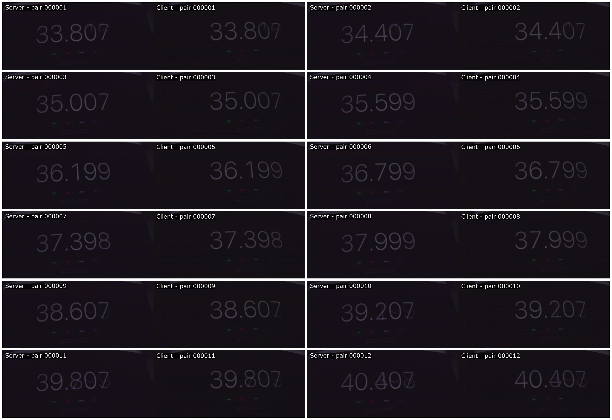

# 120 Hz Display Clock Validation

## Purpose

This test used a millisecond counter on a 120 Hz external display as a visual target for the synchronized IMX283 pair. The goals were to find the shortest readable exposure and determine what synchronization claims the display can support.

## Camera Configuration

- Resolution: 2736 x 1824
- Frame rate: 5 fps
- Manual analogue gain: 16.0, the maximum reported by both cameras
- Manual exposure sweep: 100, 200, 400, 800, 1200, 1600, 2400, 3200, 4800, 6400, and 8000 us
- Sync server: camera 0
- Sync client: camera 1
- `SyncFrames`: 100
- Two stable metadata frames required after each exposure change

The driver reported a common exposure range of 1 to 66,666 us and an analogue-gain range of 1.0 to 16.0.

## Exposure Control Validation

The sensor quantized requested exposure times to its available line timing:

| Requested exposure | Actual server | Actual client |
| ---: | ---: | ---: |
| 100 us | 93 us | 93 us |
| 200 us | 194 us | 194 us |
| 400 us | 396 us | 396 us |
| 800 us | 799 us | 799 us |
| 1200 us | 1195 us | 1195 us |
| 1600 us | 1598 us | 1598 us |
| 2400 us | 2397 us | 2397 us |
| 3200 us | 3196 us | 3196 us |
| 4800 us | 4795 us | 4795 us |
| 6400 us | 6393 us | 6393 us |
| 8000 us | 7999 us | 7999 us |

Both cameras used an actual analogue gain of 16.0 at every step.

## Readability Result

- 93 us was barely readable but dark and sensitive to display-refresh transitions.
- 194 us was the shortest practical exposure for manual reading in this scene.
- 396 us gave a clearer and more comfortable visual reading.
- Longer exposures increased scene brightness but also integrated more of the display transition.

The recommended starting point for this specific target is therefore a requested exposure of 200 us at gain 16. A requested 400 us is preferable when reliable manual reading matters more than minimizing exposure duration.

## Timestamp Results

Across the 11-step sweep, the client-minus-server sensor timestamp delta ranged from -73 to +15 us. The mean absolute delta was 37.3 us.

A second run captured 12 pairs at a requested 200 us, with an actual exposure of 194 us on both cameras. Its sensor timestamp results were:

- Range: -65 to +16 us
- Mean absolute delta: 36.6 us
- 95th-percentile absolute delta: 65 us
- Maximum absolute delta: 65 us

## Visible Clock Result

The external clock images sometimes showed the same millisecond value and sometimes appeared approximately 8 to 16 ms apart. Longer-exposure pairs frequently differed by approximately 8 ms, close to one 120 Hz refresh period of 8.33 ms.

This visible difference does not agree with the tens-of-microseconds sensor timestamps and must not be interpreted directly as camera frame-start error.

## Post-Alignment Repeat

The test was repeated on 2026-07-18 after replacing a faulty FPC cable, rebooting the Raspberry Pi, and mounting both camera modules with matching image orientation. The counter was also placed at approximately the same sensor-row coordinate in both unrotated images.

Both cameras enumerated correctly and completed independent JPEG captures before the synchronized run. The previous I2C `-121` error did not recur.

The repeat used these settings:

- Resolution: 2736 x 1824
- Frame rate: 5 fps
- Requested exposure: 200 us
- Actual exposure: 194 us on both cameras
- Analogue gain: 16.0 on both cameras
- Captured pairs: 12

All 12 pairs showed the same visible counter state in the server and client images:

| Pair | Server display | Client display | Timestamp delta, client minus server |
| ---: | ---: | ---: | ---: |
| 1 | 33.807 | 33.807 | -33 us |
| 2 | 34.407 | 34.407 | -32 us |
| 3 | 35.007 | 35.007 | -32 us |
| 4 | 35.599 | 35.599 | -32 us |
| 5 | 36.199 | 36.199 | -33 us |
| 6 | 36.799 | 36.799 | -31 us |
| 7 | 37.398 | 37.398 | -31 us |
| 8 | 37.999 | 37.999 | -32 us |
| 9 | 38.607 | 38.607 | -30 us |
| 10 | 39.207 | 39.207 | -32 us |
| 11 | 39.807 | 39.807 | -31 us |
| 12 | 40.407 | 40.407 | -31 us |

The pair-12 display transition contained some visible refresh ghosting, but both cameras recorded the same transition state.

The metadata statistics for this run were:

- Range: -33 to -30 us
- Mean absolute delta: 31.667 us
- 95th-percentile absolute delta: 33 us
- Maximum absolute delta: 33 us

This is the strongest result from the display-clock tests. Matching camera orientation and sensor-row placement removed the previously observed one- or two-refresh visible offset. This strongly supports the explanation that the earlier 8 to 16 ms discrepancy came from rolling-shutter geometry and display scanout rather than from a comparable camera frame-start error. The metadata distribution was also tighter in this run, although a single test cannot establish that physical rotation caused the metadata improvement.

## Why the Display Is a Coarse Instrument

A 120 Hz display presents only 120 new visual states per second. Even if the counter text contains three decimal digits, the physical panel cannot present an independently measurable state every millisecond. Its fundamental state interval is approximately 8.33 ms.

The IMX283 uses a rolling shutter. Different sensor rows begin exposure at different times. If the clock appears at different sensor rows in the two camera images, or the two modules have different physical orientations relative to the readout direction, the clock region is sampled at different times even when the frame-start timestamps are aligned.

The display itself also scans pixels over time. A camera exposure near a display refresh boundary may contain an old value, a new value, or a visible mixture of both. The effect becomes more prominent when exposure spans a larger fraction of the 8.33 ms refresh interval.

## Correct Use of This Test

The display test can verify that both cameras are in approximately the same display-frame state and can reveal whole-frame drift. It cannot resolve or disprove a 20 to 70 us frame-start offset.

For a stronger repeat:

1. Mount both camera modules in the same physical orientation so their rolling-shutter directions match.
2. Place the counter at the same sensor-row coordinate in both unrotated JPEGs.
3. Use a requested 200 or 400 us exposure at gain 16.
4. Capture at least 50 pairs and retain metadata for every pair.
5. Classify visible values by 120 Hz display state rather than treating the printed millisecond digits as 1 ms ground truth.
6. Use an externally driven LED or LED timecode source for sub-millisecond visual validation.

For the current setup, the visible result shows that all 12 tested pairs captured the same 120 Hz display state, at a coarse 8.33 ms state interval. The reliable finer-grained quantitative result remains the sensor metadata: a maximum absolute frame-start delta of 33 us in the post-alignment run.
